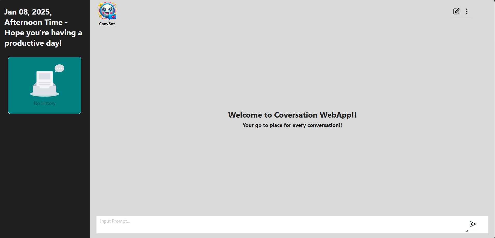

# GenAI Web App

## Description

GenAI is a web application that leverages the power of Generative AI to provide users with a variety of functionalities and insights. The front-end is built using ReactJS, Redux, and Ant Design, while the back-end is powered by Flask and MongoDB. Data manipulation and analysis are handled using Pandas.

## Table of Contents

- [Installation](#installation)
- [Features](#features)
- [Usage](#usage)
- [Technologies Used](#technologies-used)
- [Project Structure](#project-structure)
- [Contributing](#contributing)
- [License](#license)

## Installation

### Prerequisites

- Node.js
- Python
- MongoDB

### Front-End

1. Navigate to the front-end directory:
   ```bash
   cd frontend
   ```
2. Install the dependencies:
   ```bash
   npm install
   ```
3. Start the development server:
   ```bash
   npm start
   ```

### Back-End

1. Navigate to the back-end directory:
   ```bash
   cd backend
   ```
2. Create a virtual environment and activate it:
   ```bash
   python -m venv venv
   source venv/bin/activate  # On Windows use `venv\Scripts\activate`
   ```
3. Install the dependencies:
   ```bash
   pip install -r requirements.txt
   ```
4. Start the Flask server:
   ```bash
   flask run
   ```

### MongoDB

1. Ensure MongoDB is running on your system. You can start MongoDB using:
   ```bash
   mongod
   ```

## Features

- User Authentication
- Data Visualization
- AI-Powered Predictions
- Responsive Design
- Interactive Dashboards

## Usage

1. Access the web app by navigating to `http://localhost:3000` for the front-end.
2. Interact with various features such as data visualizations, AI-powered predictions, and more.

## Technologies Used

- **Front-End:**
  - ReactJS
  - Redux
  - Ant Design (antd)
- **Back-End:**
  - Flask
  - MongoDB
  - Pandas


## Project Structure
```
GenAI/
├── client/
│   ├── public/
│   ├── src/
│   │   ├── components/
│   │   ├── redux/
│   │   ├── styles/
│   │   ├── App.js
│   │   └── index.js
│   ├── package.json
│   └── README.md
├── server/
│   ├── app/
│   │   ├── __init__.py
│   │   ├── routes/
│   │   ├── models/
│   │   └── utils/
│   ├── venv/
│   ├── requirements.txt
│   └── README.md
├── .gitignore
├── LICENSE
└── README.md
```



#